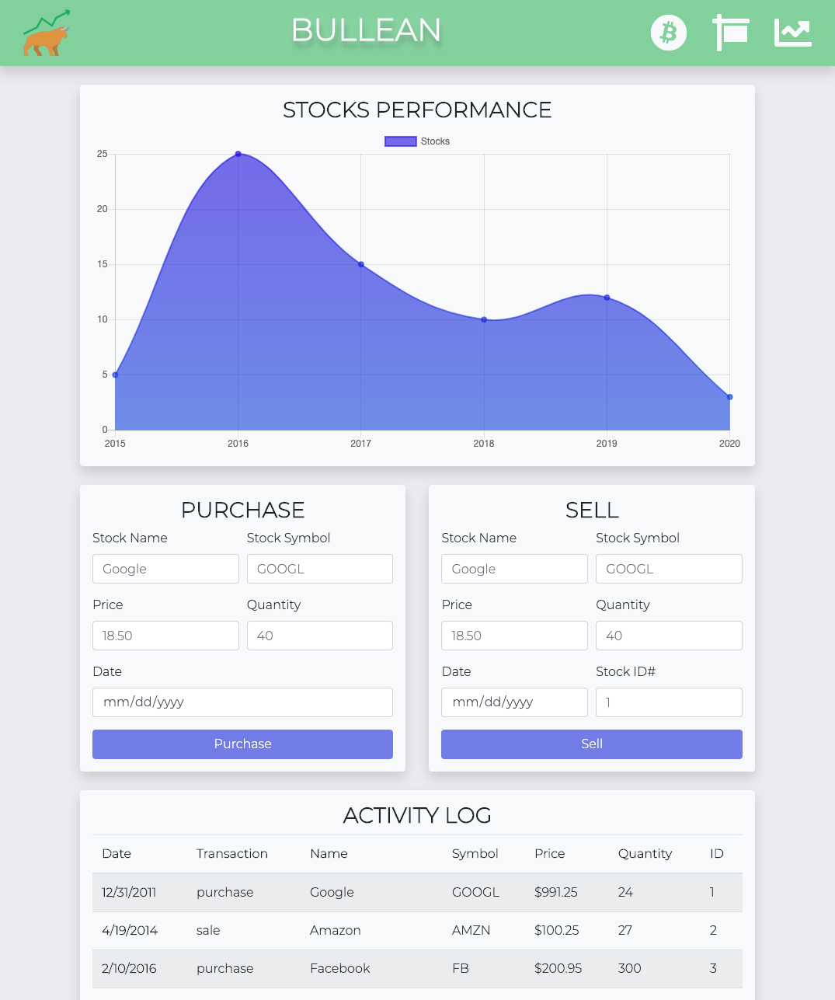
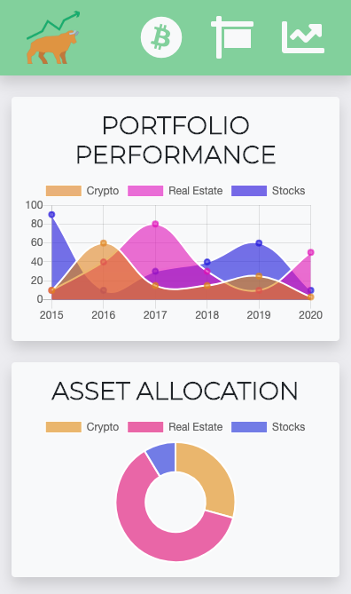

# Bullean

## About
Full-stack app that consolidates your investment portfolio into sleek and intuitive interface.

See the app in action over at [Heroku](https://bullean-app.herokuapp.com/).

## Features

- [Portfolio Page](#portfolio)
  - Brings all of your investments to a single, easy to read page. 
  - **Portfolio Performance**: Contrasts Crypto, Real Estate, and Stock performances to help visualize which assets are performing the best.
  - **Asset Allocation**: Graphical representation of your portfolio's asset distribution.
  - **Activity Log**: Displays transaction history for all assets.

- [Crypto / Real Estate / Stocks](#assets)
  - Each asset page displays:
    - **Line chart**: Visualize the valuation of your asset over time.
    - **Purchase field**: Add recently purchased items.
    - **Sell field**: Remove items that you've sold.
    - **Activity Log**: Displays transaction history for that assets.

- [Fully Responsive](#responsive) display for an enjoyable experience on a mobile, tablet, or desktop.

___
###  Portfolio Page
*Desktop view*

___
###  Crypto / Real Estate / Stocks
*Tablet view*

___
###  Responsive Display
*Mobile view*  

___

## Built With
* Node.js
* Express
* MySQL
* Sequelize
* Handlebars
* Jest

## Authors
- Mike Hume
- Andrew Clement 
- Anand "The Great" Davaadorj
- Steven Slyker
