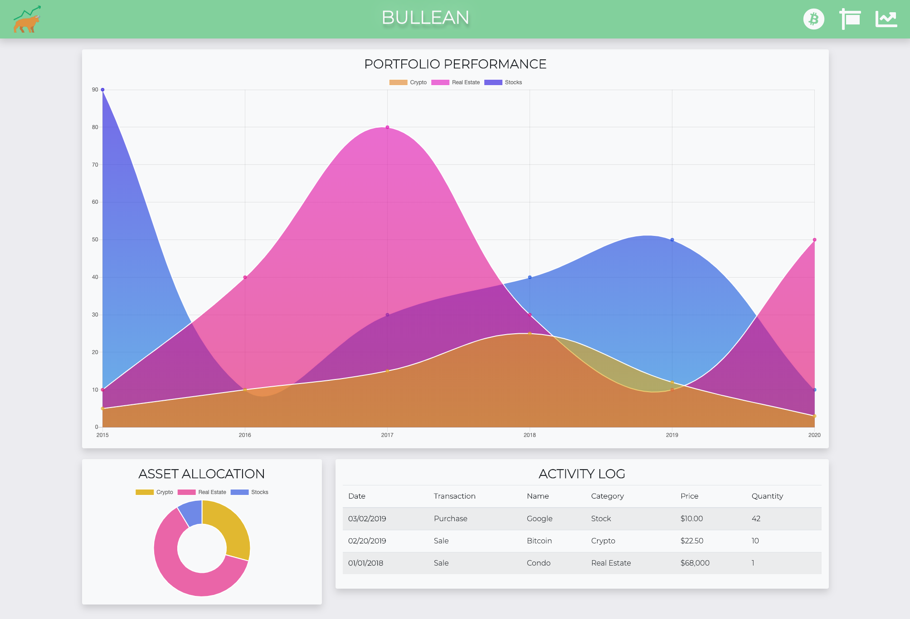
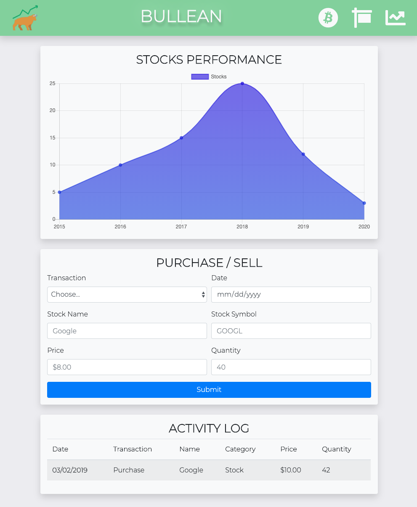

# Bullean

## About
Full-stack app with the focus of consolidating your investment portfolio into an intuitive data-forward interface.

## Getting Started

See the app in action over at [Heroku](https://pure-earth-83150.herokuapp.com/).

Keep track of the following assets of your portfolio:
-   [Crypto](#crypto):
-   [Real Estate](#real-estate):
-   [Stocks](#stocks):

___
###  Crypto

#### Purchase / Sell

1.  Fill in the required fields
2.  Submit
3.  Your purchase / sale will be added to the database
4.  The graph will reflect your current assets.

___
###  Real Estate

#### Purchase / Sell

1.  Fill in the required fields
2.  Submit
3.  Your purchase / sale will be added to the database
4.  The graph will reflect your current assets.

___
###  Stocks

#### Purchase / Sell

1.  Fill in the required fields
2.  Submit
3.  Your purchase / sale will be added to the database
4.  The graph will reflect your current assets.

___
## Built With
* Node.js
* Express
* MySQL
* Sequelize
* Handlebars
* Jest

## Authors
- Mike Hume
- Andrew Clement 
- Anand "The Great" Davaadorj
- Steven Slyker
